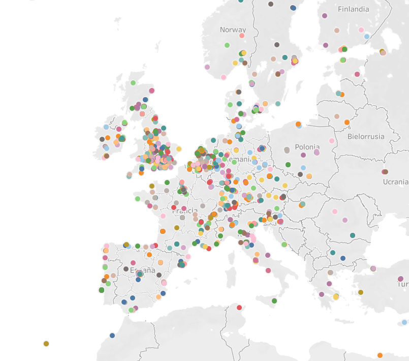
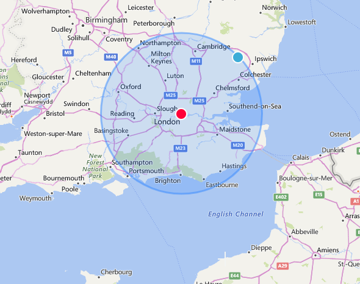
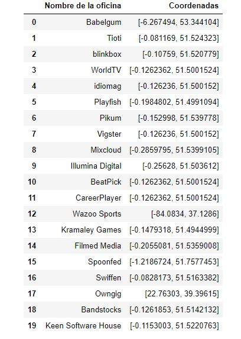
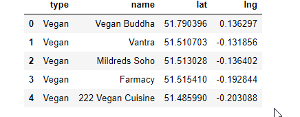
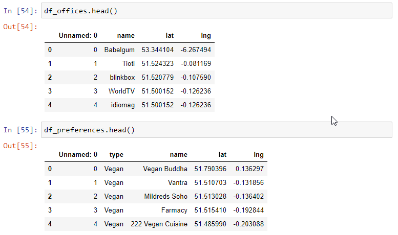
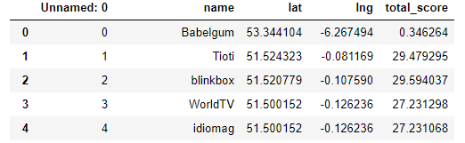
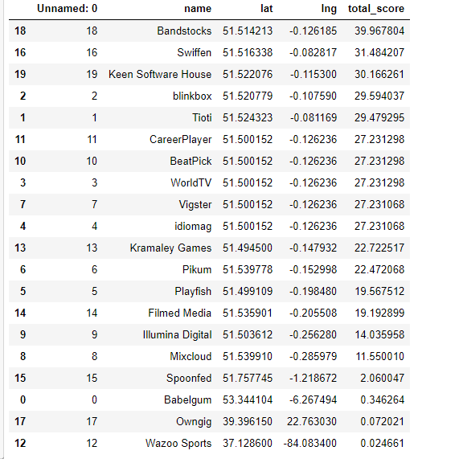
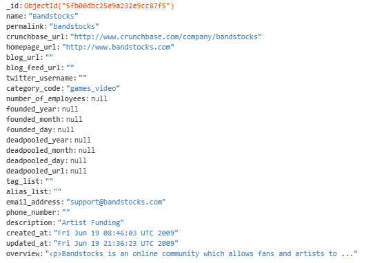

# GeoSpatial Project

## Project description

In this project, I worked with a database of companies in the world to do geolocation work using GeoJson. Wikipedia defines **GeoJSON** as "an open standard format designed to represent simple geographic elements, along with their non-spatial attributes, based on JavaScript Object Notation. The format is widely used in mapping applications in web environments by allowing the exchange of data quickly, lightly and easily".

In this project, we had to find the best possible location for a video game company based on the requirements of the template, which had to be prioritized and try to meet as many of them as possible.

The **workers** and their respective **preferences** were:

#### Workers:

- 20 Designers
- 5 UI/UX Engineers
- 10 Frontend Developers
- 15 Data Engineers
- 5 Backend Developers
- 20 Account Managers
- 1 Maintenance guy that loves basketball
- 10 Executives
- 1 CEO/President

#### Preferences:

- Designers like to **go to design talks and share knowledge**. There must be some nearby companies that also do design.
- 30% of the company have at least **1 child**.
- Developers like to be near **successful tech startups that have raised at least 1 Million dollars**.
- **Executives like Starbucks A LOT**. Ensure there's a starbucks not to far.
- Account managers need to **travel a lot**
- All people in the company have between 25 and 40 years, give them some place to **go to party**.
- The CEO is **Vegan**
- If you want to make the maintenance guy happy, a **basketball stadium** must be around 10 Km.
- The office dog "Pepe" needs a **hairdresser every month**. Ensure there's one not too far away.

## Goals

- Find the best location for my company
- Try to respect the preferences of each worker

## How I did it

First, I examined the map with *Tableau* to see where the most companies were concentrated and most likely to succeed. I wanted my company to be in Europe, so I chose the area where there was the most concentration: the United Kingdom. When I looked more closely, I noticed that almost all the companies were within a 100 km radius of the center in London. Our company was a **videogame company**, so I looked at the video game offices that existed in London, and found 20 possible offices to establish my company in the database I worked with.
Previously, I filtered all the companies to have latitude and longitude and to be able to geolocate all of them. Also, when the companies had several addresses, I separated them into several locations, to have more breadth in my options.
To do this, I used Mongo Compass, pymongo, python, Tableau and pandas.

Companies in Europe:

100 km radius from London:

Then, I created a dataframe using **pandas** 🐼 in order to have a better visualization of data:

I saved this dataframe into a **.csv** file to work with it later.

To do this, I have used **Mongo Compass, pymongo, python, Tableau and pandas**.

Then, I used a localization function to search by keywords the sites I was interested in.

Using the coordinates of the center of London with my radius of 100km, I made requests to Google to return to me all the companies that met the requirements I was interested in and create a list of dictionaries for each one (name and coordinates).

Finally, I chose my ideal office by creating a function that included the **haversine** formula and accepted coordinates from both DataFrames (offices and sites of preference).

Later, using a loop, I obtained the total score regarding the good or bad situation of the place (I considered it a good score that it was close to all the stores that interested me).

After this, I ordered the results from best to worst and I obtained that the best possible location for the company is the **Bandstocks** office.

